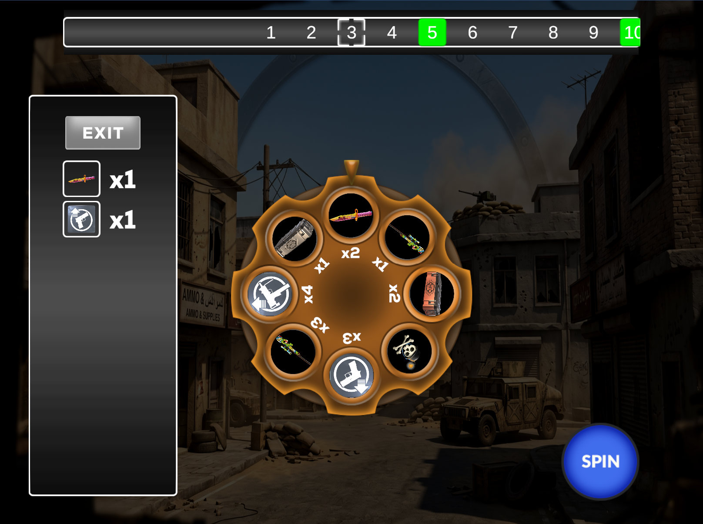
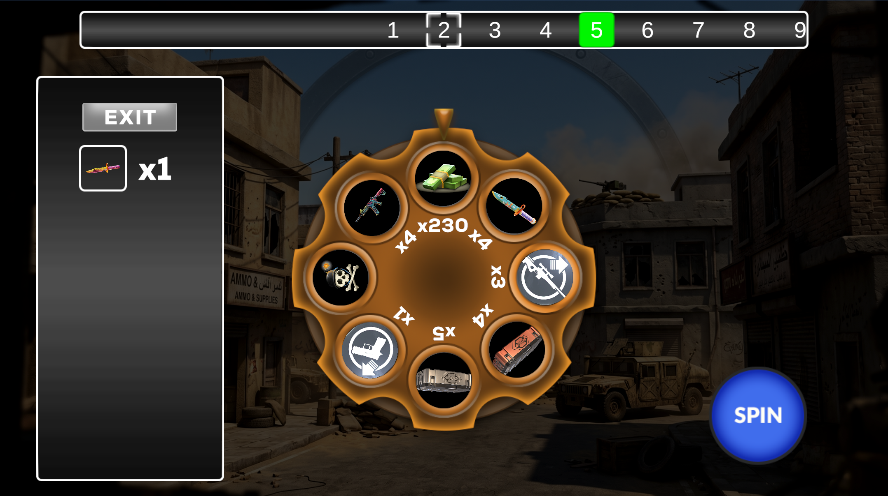
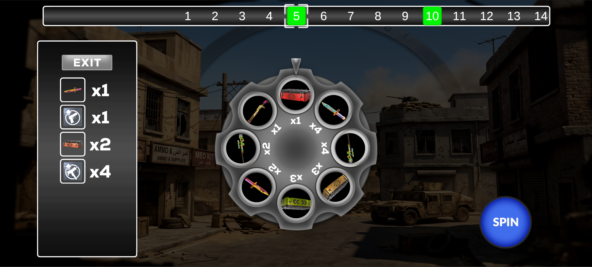

https://github.com/user-attachments/assets/b9954e75-b8ed-4f24-9b0c-c2d7993c06cb

 

 

 Responsive UI (Esnek Çözünürlük Desteği)
Oyunun arayüzü; Anchor, Content Size Fitter ve Preserve Aspect ayarları kullanılarak farklı cihaz ekranlarında esnemeyecek veya bozulmayacak şekilde kurgulanmıştır.

   
   
   

---

